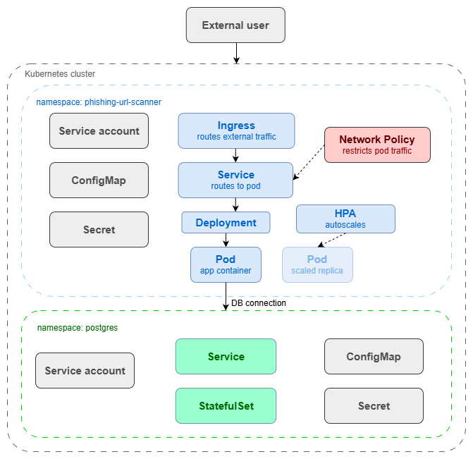

# Phishing URL Scanner

An application built in Golang that scans URLs for phishing indicators. It accepts a URL, analyses it against multiple detection sources, and returns a verdict. Results are persisted in a Postgres database.

Write-up series documenting my learning journey and decisions made along the way:\
[Part 1 – Docker & Kubernetes](https://blog.wongyx.com/docker-kubernetes-security-part-1-building-and-securing-a-phishing-url-scanner-locally)
<!--Part 2 – Deploying on AWS EKS-->

## Tech Stack

- **Golang** — Gin web framework, GORM for database access
- **Docker** — Multi-stage builds, Docker Compose for local development
- **Kubernetes / Minikube** — Local cluster with nginx ingress, HPA, StatefulSet for Postgres
- **Postgres** — Stores scan results and history

## Kubernetes Architecture

## How It Works

When a scan request comes in, three checks run in parallel:

1. **VirusTotal API** — Checks how many security vendors have flagged the URL
2. **Google Safe Browsing API** — Checks against known phishing and malware sites
3. **Domain age check** — Queries RDAP records; newly registered domains are a common phishing signal

Results are aggregated into a single verdict and stored in Postgres.

## Security Configurations

### Docker

- **Distroless base image** — No shell, package manager, or debugging tools in the final image
- **Strip debug info** — Binary compiled with `-ldflags="-s -w -buildid="` to remove symbol table and DWARF data
- **Non-root user** — Application process runs as an unprivileged user

### CI/CD

- **Semgrep** — Scans Golang source code on every pull request using the `p/golang` ruleset; blocks merge on ERROR severity findings
- **Gitleaks** — Secret scanning on every pull request; blocks merge if secrets are detected
- **Trivy** — Scans the built container image for CVEs; blocks push to Docker Hub on HIGH or CRITICAL findings

### Kubernetes

- **Pod security context** — `runAsNonRoot: true`, `runAsUser: 1001`, `seccompProfile: RuntimeDefault`
- **Container security context** — `allowPrivilegeEscalation: false`, `readOnlyRootFilesystem: true`, all Linux capabilities dropped
- **Pod Security Admission** — `restricted` enforcement on the application namespace; `baseline` enforcement on the Postgres namespace
- **Network Policy** — Ingress restricted to the nginx ingress controller; egress restricted to Postgres on port 5432 and DNS on port 53
- **Service account** — Dedicated service account for the application with `automountServiceAccountToken: false`
- **Horizontal Pod Autoscaler** — Automatically scales pods based on CPU utilisation
